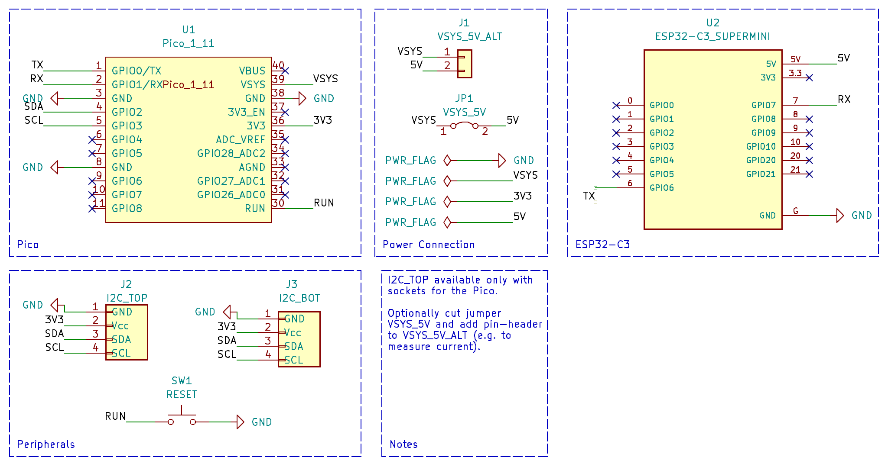
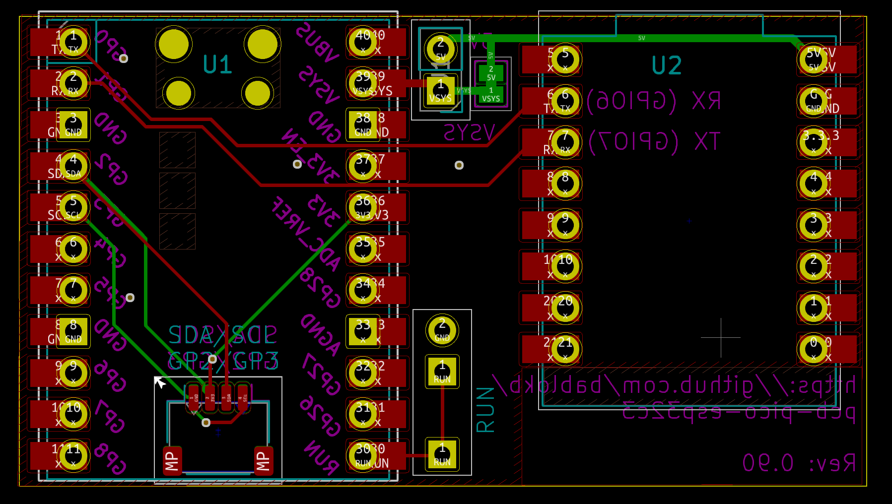
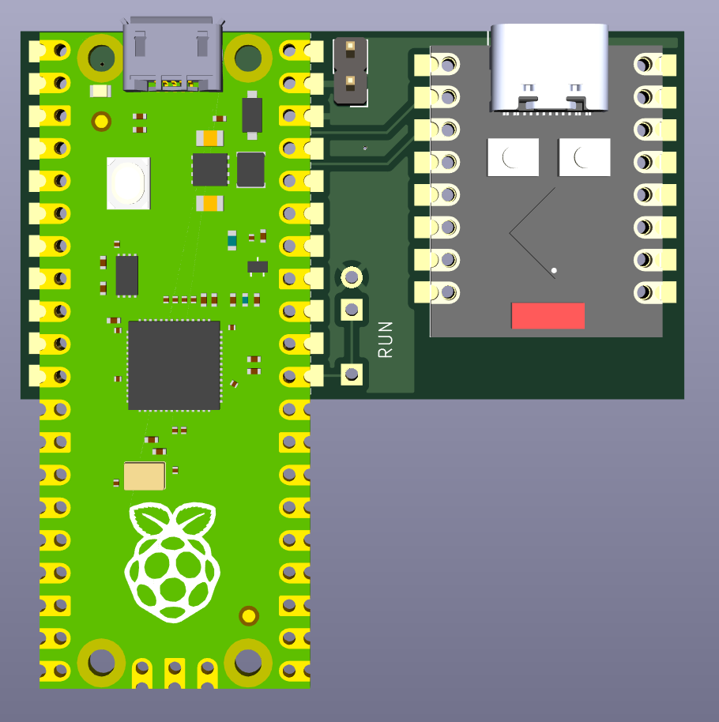
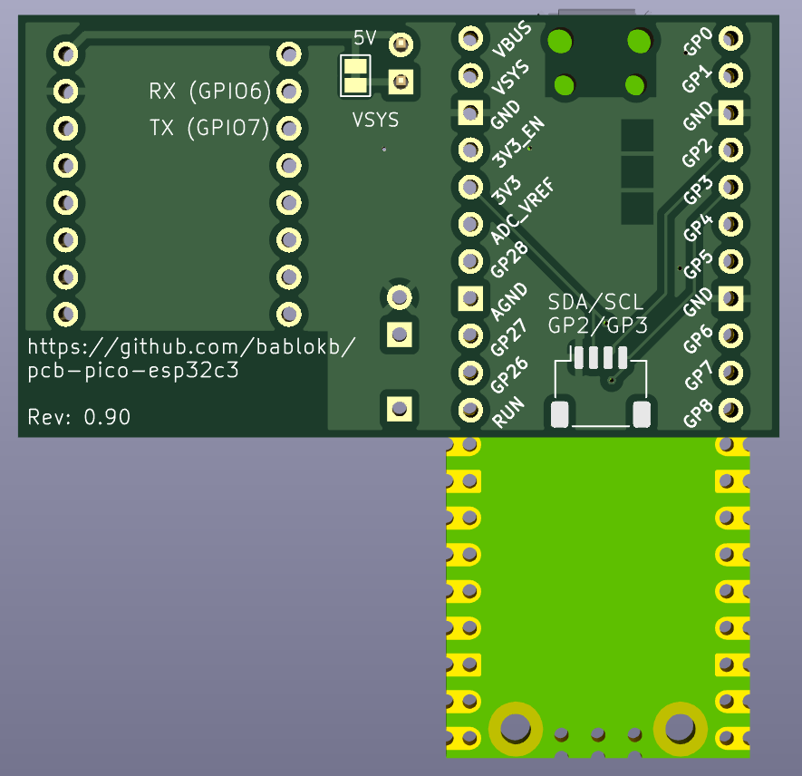

Pico - ESP32C3 Super-Mini Connector
===================================

In this repository you will find the KiCAD (v7) design-files for a small PCB
that connects the Pico UART-pins GP0/GP1 with the ESP32C3-SuperMini UART1-pins.

If the ESP32C3 is flashed with the [AT-firmware](https://github.com/espressif/esp-at),
the Pico can communicate directly with the C3.

See <https://github.com/bablokb/circuitpython-esp32at> for a software solution.

Ready to use production files for JLCPCB are in the directory `production_files/`.

Schematic
---------

Layout
------

3D-Views
--------

License
-------

[![CC BY-SA 4.0][cc-by-sa-shield]][cc-by-sa]

This work is licensed under a
[Creative Commons Attribution-ShareAlike 4.0 International
License][cc-by-sa].

[![CC BY-SA 4.0][cc-by-sa-image]][cc-by-sa]

[cc-by-sa]: http://creativecommons.org/licenses/by-sa/4.0/
[cc-by-sa-image]: https://licensebuttons.net/l/by-sa/4.0/88x31.png
[cc-by-sa-shield]:
https://img.shields.io/badge/License-CC%20BY--SA%204.0-lightgrey.svg
